# HTB-Nibble
Machine Hack the box Nibble
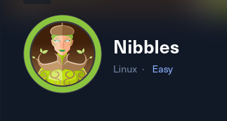

## RECON

**Nmap**

**2 TCP ports opens**

Discovered open port 22/tcp on 10.10.10.75
Discovered open port 80/tcp on 10.10.10.75
***************
**Services**
22/tcp open  ssh     syn-ack OpenSSH 7.2p2 Ubuntu 4ubuntu2.2 (Ubuntu Linux; protocol 2.0)

80/tcp open  http    syn-ack Apache httpd 2.4.18 ((Ubuntu))

**Check the Website** 

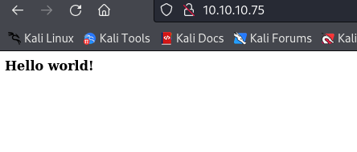

I check source code

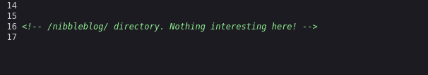

 **!!Web blog¡¡** 

 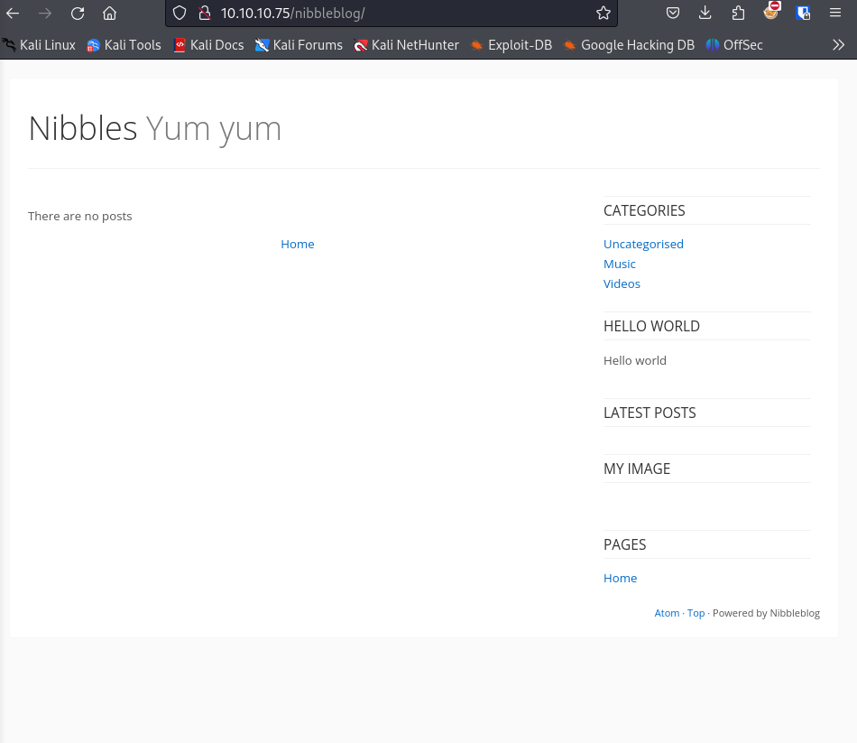

try to find an exploit to nibbleblog

## EXPLOIT

**I find one exploit in a metasploit module**

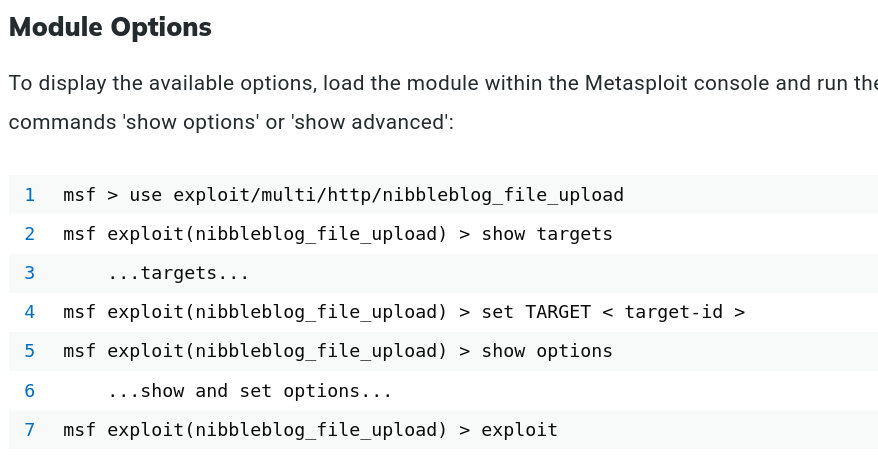

and explore to subdomains

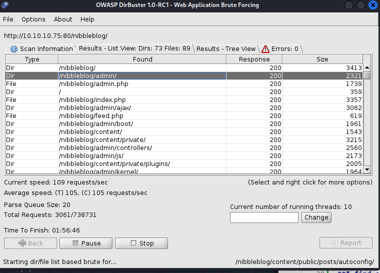

**admin.php**

and ask for user 

we finf user,xml 

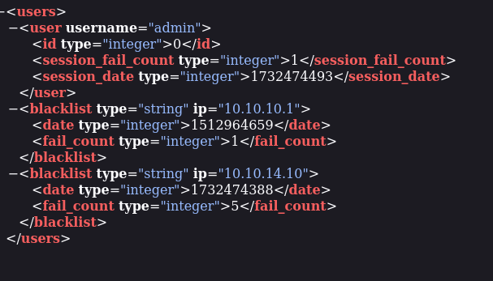

we try password **nibbles**

we find the version of the nibbleblog
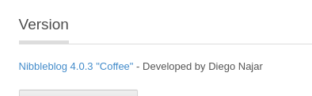

we fins  a Vulnerability 

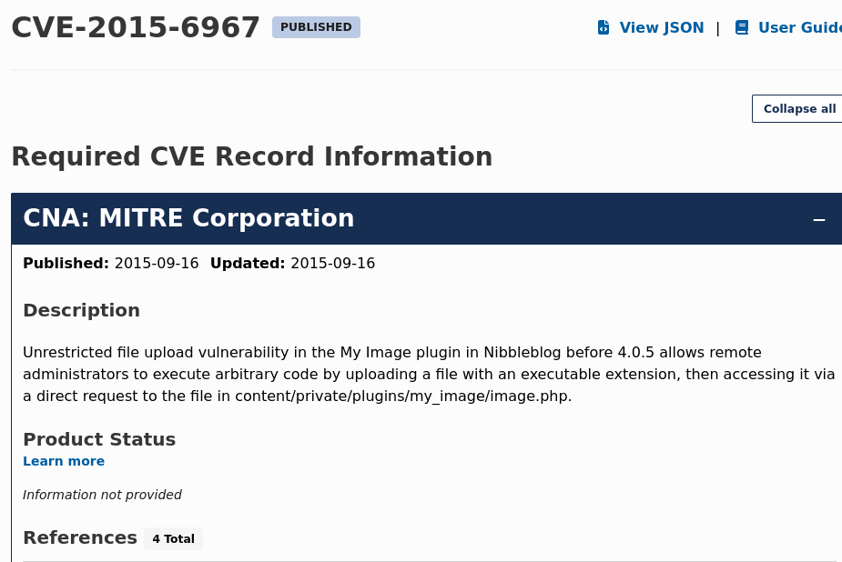

Use the metasploit exploit 

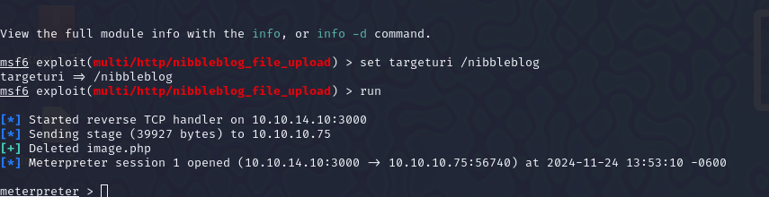

use user flag 

Find out a script to priv escalation 

We temper the script to revesrse shell and liset to nc port 

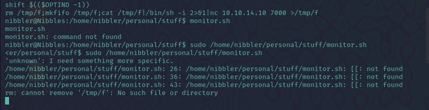

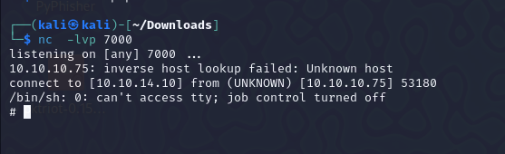

Im root 💀

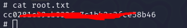